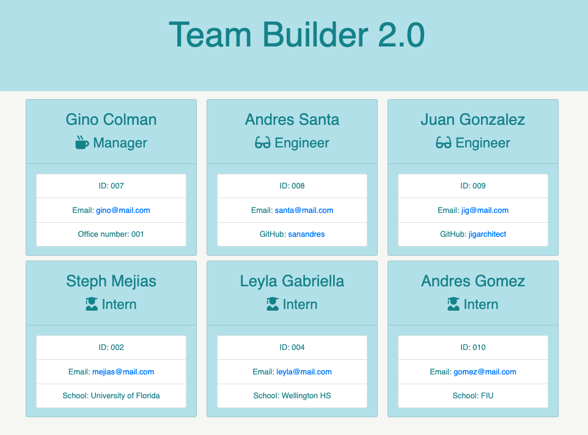

# Team Profile Generator

## Description

* This application allows you to create Roster/Profile for your associates that are a Manager, Engineer, or intern. This is useful as you can gather all the relevant contact information for your team and output it all to a web page. 
* This application can be used as a shortcut to creating a concise and simple info page about your asscoiates currently on staff. 

## Table of Content

* [Installation](#installation) 
* [Usage](#usage) 
* [Credits](#credits) 
* [License](#license)

## Installation

* Created a git repository
* Installed inquirer package in order to prompt questions and selections onto console
* Created questions needed to create profile of each associate(Manager, Engineer, and Intern)
* Created HTML Templates for each associate and a main page
* Added a js file to join all the HTML pages together
* App.js holds the code to trigger the questions to output to the console when prompted
* In app.js there is a fs.writeFileSync function in order to output the HTML page created by answering the questions in the console
* To start application just type "npm start" in the console
* Run "npm test" to run some tests on the Employee.js, Engineer.js, Intern.js, and Manager.js files 

## Difficulties
* The main issue I ran into was running the tests for the js files, however it all came down to a simply updating the package "jest" in order to get it to work. 

## Usage

* video link:

* Node.js
* Inquirer Package
* Variables Created
* Console logging
* test.js
* Files Systems
* Template Literals

## Credits

Created by myself

## License

MIT License

Copyright (c) [2022] [Gino Colman]

Permission is hereby granted, free of charge, to any person obtaining a copy
of this software and associated documentation files (the "Software"), to deal
in the Software without restriction, including without limitation the rights
to use, copy, modify, merge, publish, distribute, sublicense, and/or sell
copies of the Software, and to permit persons to whom the Software is
furnished to do so, subject to the following conditions:

The above copyright notice and this permission notice shall be included in all
copies or substantial portions of the Software.

THE SOFTWARE IS PROVIDED "AS IS", WITHOUT WARRANTY OF ANY KIND, EXPRESS OR
IMPLIED, INCLUDING BUT NOT LIMITED TO THE WARRANTIES OF MERCHANTABILITY,
FITNESS FOR A PARTICULAR PURPOSE AND NONINFRINGEMENT. IN NO EVENT SHALL THE
AUTHORS OR COPYRIGHT HOLDERS BE LIABLE FOR ANY CLAIM, DAMAGES OR OTHER
LIABILITY, WHETHER IN AN ACTION OF CONTRACT, TORT OR OTHERWISE, ARISING FROM,
OUT OF OR IN CONNECTION WITH THE SOFTWARE OR THE USE OR OTHER DEALINGS IN THE
SOFTWARE.
